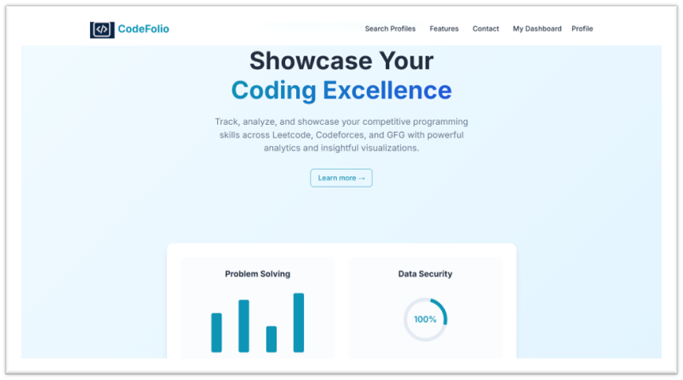
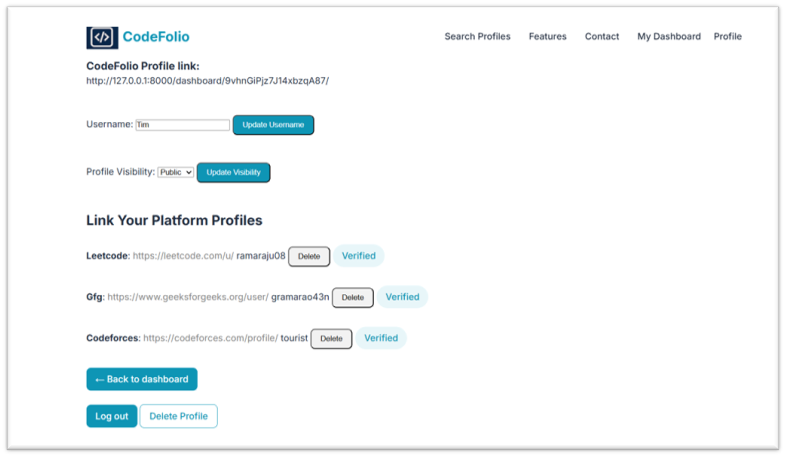
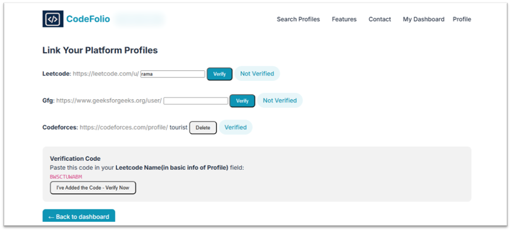
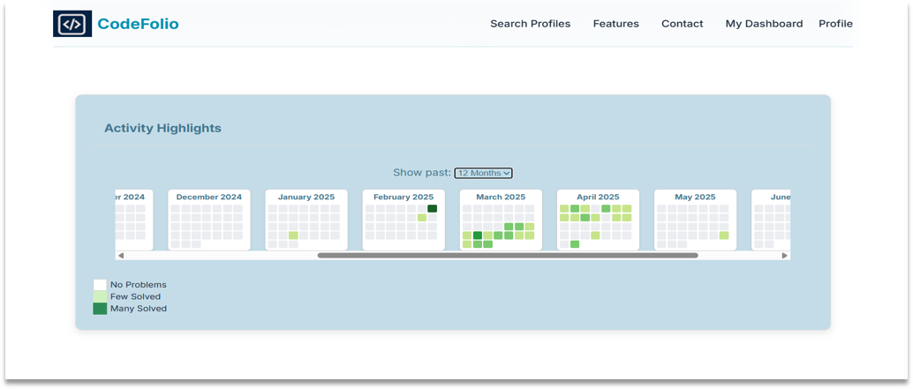
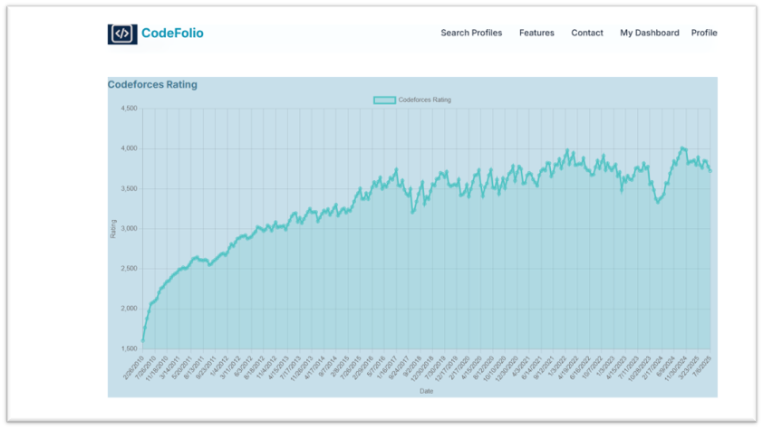
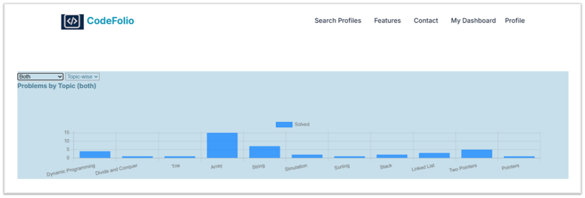

# CodeFolio

CodeFolio is a personal coding portfolio and analytics platform built with Django. It allows users to connect their profiles from competitive programming platforms and visualize their progress with interactive charts, streak heatmaps, and achievements — all in one place.

## 🚀 Features
- 📊 Multi-Platform Integration – Fetch and display data from platforms like Codeforces (rank, rating, problems solved, streaks, badges).
- 🔥 Firestore Storage – Securely store user-specific analytics and history.
- 📅 Streak Tracking – Visualize daily coding activity using heatmaps and calendars.
- 🏆 Achievements & Badges – Showcase milestones dynamically.
- 📈 Dynamic Graphs – Render charts using Chart.js for ratings, ranks, and progress trends.
- 🔒 Authentication – Firebase-based login for secure user sessions.
- 🌐 Dashboard – A personalized dashboard that updates data on every visit.

## 🛠️ Tech Stack
- **Backend:** Django  
- **Frontend:** HTML, CSS, JavaScript, Chart.js  
- **Database:** Firebase Firestore  
- **APIs:** Codeforces API, custom data endpoints  
- **Hosting:** (add here if you plan to host on Heroku, Vercel, etc.)

## 📂 Project Structure

```
CodeFolio/
├── dashboard/          # Django app for user dashboard
├── viz/               # Visualization features (charts, heatmaps)
├── static/            # Static files (JS, CSS)
├── templates/         # HTML templates
└── manage.py          # Django entry point
```

## ⚙️ Installation
1. Clone the repo:
   ```bash
   git clone https://github.com/LMeghanath/CodeFolio.git
   cd CodeFolio
   ```

2. Create & activate virtual environment:
   ```bash
   python -m venv venv
   source venv/bin/activate    # Mac/Linux
   venv\Scripts\activate       # Windows
   ```

3. Install dependencies:
   ```bash
   pip install -r requirements.txt
   ```

4. Run migrations:
   ```bash
   python manage.py migrate
   ```

5. Start the server:
   ```bash
   python manage.py runserver
   ```

## 📊 Screenshots

### 🏠 Landing Page

*Main landing page showcasing the platform's core features and value proposition*

### ⚙️ Profile Settings

*User profile management with platform linking and verification system*

### 🔗 Platform Integration

*Connect and verify your coding profiles from multiple platforms*

### 📈 Streak Analysis

*Shows the cumilative streak across the platforms*

### 📈 Rating Analytics

*Interactive Codeforces rating progression chart with historical data*

### 📊 Problem Analysis

*Detailed breakdown of problems solved by topic and difficulty*

## 📌 Roadmap
* Add more platforms (LeetCode, CodeChef, HackerRank)
* Advanced analytics & recommendations
* User profile sharing with custom portfolio link

## 🤝 Contributing
Contributions are welcome! Feel free to fork the repo, open issues, and submit pull requests.

## 📜 License
This project is licensed under the MIT License.

## 👤 Author
**L. Meghanath Sri Satyanarayana**
* 🌐 GitHub
* 📧 Add your email here if you want
